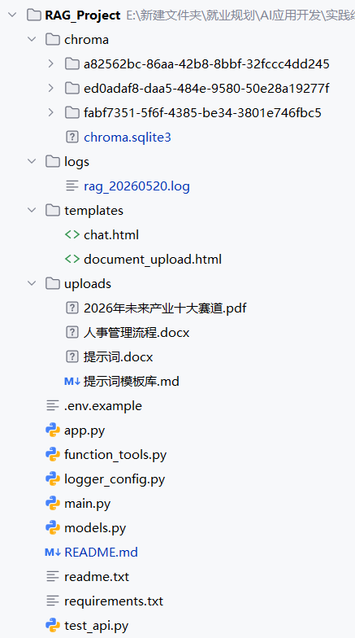
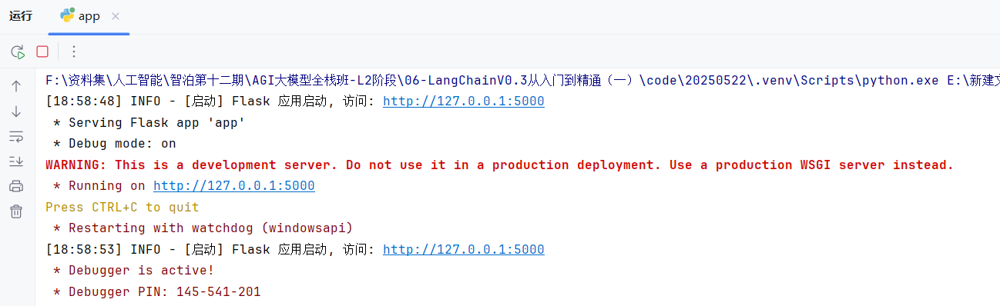
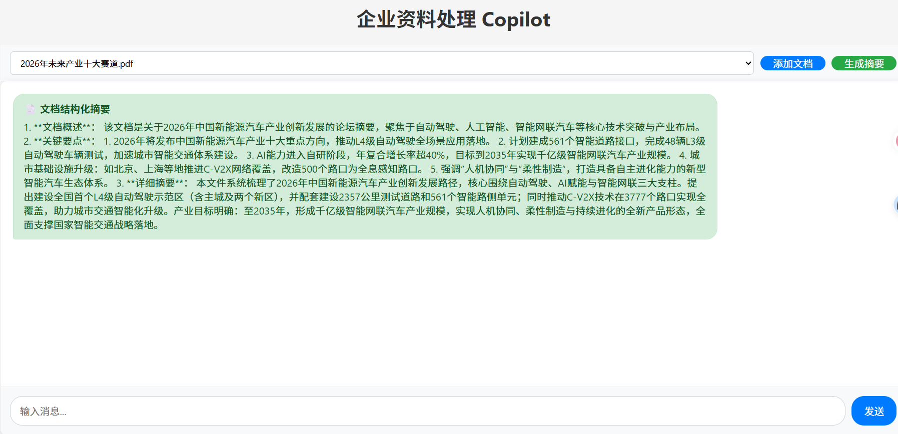
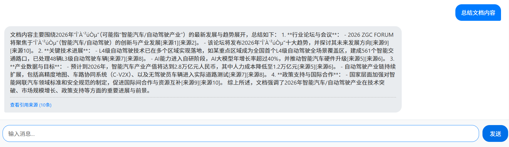
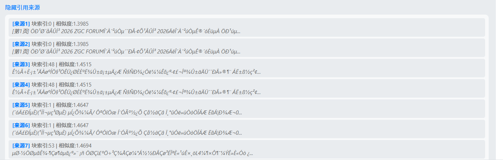

# 企业资料处理 Copilot MVP

基于 RAG（检索增强生成）技术的企业文档问答与摘要系统，支持文档上传、智能问答（含引用来源标注）、结构化摘要生成。

## 架构概览

```
用户上传文档 → 文本提取+分块 → 向量嵌入 → ChromaDB 存储
用户提问 → 语义检索 → 构建 Prompt(含引用标注) → LLM 生成 → 返回答案+来源
用户请求摘要 → 检索文档块 → LLM 生成结构化摘要 → 返回概述+要点+详细摘要
```

展示的关键链路：**RAG 全流程**（文档加载 → 分块 → 嵌入 → 检索 → 引用增强 Prompt → LLM 生成）

## 技术栈

- **Web 入口**: Flask (Python)
- **向量数据库**: ChromaDB (持久化)
- **嵌入模型**: 阿里通义千问 text-embedding-v4
- **对话模型**: 阿里通义千问 qwen-turbo-latest
- **文档处理**: python-docx (Word), PyPDF2 (PDF)
- **文本分块**: LangChain RecursiveCharacterTextSplitter
- **日志系统**: Python logging (双通道: 控制台+文件)

## 安装与启动

### 1. 安装依赖

```bash
pip install -r requirements.txt
```

### 2. 配置环境变量

```bash
# 必须设置阿里通义千问 API Key
export DASHSCOPE_API_KEY=your_api_key_here    # Linux/Mac
set DASHSCOPE_API_KEY=your_api_key_here       # Windows CMD
$env:DASHSCOPE_API_KEY="your_api_key_here"    # Windows PowerShell
```

API Key 获取地址: https://bailian.console.aliyun.com/#/home

### 3. 启动服务

```bash
python app.py
```

### 4. 访问 Web 界面

浏览器打开 http://127.0.0.1:5000

- `/` 或 `/chat/` — 聊天问答界面（含引用来源展示）
- `/document_upload/` — 文档上传界面
- `/summary/` — 文档结构化摘要（点击聊天界面的"生成摘要"按钮）

## API 接口文档

### 问答接口 (含引用来源)

```
POST /api/chat/
```

请求体:
```json
{
  "message": "不符合录用条件的情形有哪些？",
  "collection_name": "人事管理流程.docx"
}
```

响应体:
```json
{
  "answer": "根据文档内容，不符合录用条件的情形包括...[来源1][来源2]",
  "sources": [
    {
      "ref_id": 1,
      "chunk_index": 5,
      "source": "人事管理流程.docx",
      "chunk_size": 280,
      "distance": 0.85,
      "content_preview": "不符合录用条件的情形包括：1.提供虚假入职材料..."
    }
  ]
}
```

curl 示例:
```bash
curl -X POST http://127.0.0.1:5000/api/chat/ \
  -H "Content-Type: application/json" \
  -d '{"message": "不符合录用条件的情形有哪些？", "collection_name": "人事管理流程.docx"}'
```

### 结构化摘要接口

```
POST /api/summary/
```

请求体:
```json
{
  "collection_name": "人事管理流程.docx"
}
```

响应体:
```json
{
  "summary": "文档概述：...\n关键要点：\n1. ...\n2. ...\n详细摘要：...",
  "collection_name": "renshiguanliliuchengdocx"
}
```

curl 示例:
```bash
curl -X POST http://127.0.0.1:5000/api/summary/ \
  -H "Content-Type: application/json" \
  -d '{"collection_name": "人事管理流程.docx"}'
```

### 文档集合列表接口

```
GET /api/collections/
```

响应体:
```json
{
  "collections": ["人事管理流程.docx", "提示词.docx"],
  "current": "人事管理流程.docx"
}
```

## 代码结构

项目根目录/
├── app.py
├── main.py
├── function_tools.py
├── logger_config.py
├── models.py
├── test_api.py
├── requirements.txt
├── uploads/           # 上传文件目录
├── chroma/            # 向量数据库存储目录
├── logs/              # 日志目录
└── templates/         # HTML模板目录
    ├── chat.html
    ├── document_upload.html
    └── summary.html

**图示**



## 关键文件说明

| 文件 | 功能 | 说明 |
|---|---|---|
| `app.py` | Flask Web 入口 | 定义所有路由（Web界面 + REST API），集成日志 |
| `main.py` | RAG 流程主逻辑 | `save_to_db` 上传文档、`rag_chat` 问答(含引用)、`rag_summary` 摘要 |
| `function_tools.py` | 核心工具库 | ChromaDB 操作、文档提取(docx/pdf)、LLM 调用、摘要生成、中文转拼音 |
| `models.py` | 模型配置 | 定义 API Key、模型列表、获取客户端的函数 |
| `logger_config.py` | 日志模块 | 双通道日志（控制台INFO + 文件DEBUG），专用函数记录检索/LLM/API等 |
| `templates/chat.html` | 聊天前端 | 问答界面+引用来源折叠展示+摘要按钮 |
| `templates/document_upload.html` | 上传前端 | 文档上传界面 |
| `test_api.py` | 测试样例 | 3个测试：问答+引用、摘要生成、集合列表API |

## 日志与中间过程

系统运行时自动在 `logs/` 目录下生成日志文件（如 `logs/rag_20260520.log`），记录以下关键中间过程：

- `[检索]` — 用户查询、检索的集合、返回结果数量及每条结果的距离值
- `[LLM]` — 模型名称、Prompt 长度、回复长度、Prompt 和 Response 的摘要
- `[文档处理]` — 文件路径、分块数量、目标集合名
- `[API]` — 每次请求的路径、方法、参数
- `[错误]` — 错误模块、错误信息、错误详情

控制台输出 INFO 级别摘要，日志文件保存 DEBUG 级别完整细节。

## 测试样例

运行测试:
```bash
python test_api.py
```

包含3个测试样例：
1. **问答+引用来源验证** — 发送问题，验证返回包含 answer 和 sources
2. **结构化摘要生成** — 请求摘要，验证包含概述/要点/详细摘要
3. **集合列表API** — 验证 API 返回正确的集合列表

## 运行展示



**单击网址打开网页**

**点击生成摘要**



**自由提问**





## AI 协作说明

使用豆包等工具辅助拆解功能逻辑与实现

本项目使用 Claude Code (Anthropic CLI) 作为 AI 协作工具，主要协作内容：

1. **代码审查与补全** — AI 审查了原项目代码，发现缺失的引用来源、结构化摘要、日志集成、PDF支持等功能，并逐一补全
2. **架构增强** — AI 协助设计了引用标注机制（为 ChromaDB 文档块添加 metadata，Prompt 中标注[来源X]），以及结构化摘要的 Prompt 设计
3. **日志集成** —  `logger_config.py` 定义了完整日志框架
4. **测试编写** — AI 根据功能需求编写了3个 API 测试样例，覆盖问答、摘要、集合列表三大功能
5. **文档编写** — AI 编写了完整的 README、API 文档、关键文件说明

## 真实排错记录

### 排错记录: PDF 上传失败 — 功能声明与实现不一致

**问题描述**: `app.py` 中 `ALLOWED_EXTENSIONS` 声明支持 `pdf` 格式，但 `function_tools.py` 中只有 `extract_text_from_docx` 函数，没有 `extract_text_from_pdf` 函数。用户上传 PDF 文件时，文件会被保存到 `uploads/` 目录，但 `save_to_db` 处理时跳过了 PDF 格式判断（仅处理 `.docx`/`.doc`），导致 `documents` 变量保持为空字符串 `''`，触发 `"读取文件内容为空"` 的错误返回。向量数据库中没有存储任何内容，后续问答完全无效。

**排查过程**:
1. 用户上传 PDF → 文件保存成功 → 但 `save_to_db` 返回 "读取文件内容为空"
2. 检查 `save_to_db` 函数 → 发现 `if filepath.endswith('.docx')` 判断只覆盖 Word 格式
3. 检查 `function_tools.py` → 确认缺少 `extract_text_from_pdf` 函数
4. 检查 `app.py` → 发现 `ALLOWED_EXTENSIONS` 包含 `pdf` 但后端无法处理

**修复方案**:
1. 在 `function_tools.py` 中新增 `extract_text_from_pdf()` 函数，使用 `PyPDF2.PdfReader` 提取 PDF 文本
2. 在 `main.py` 的 `save_to_db` 中添加 `.pdf` 格式判断分支
3. 添加 `PyPDF2` 到 `requirements.txt`
4. 添加 `PDF_SUPPORT` 动态检测：如果 PyPDF2 未安装则跳过 PDF 处理并记录警告日志
5. PDF 文本提取时按页标注 `[第X页]`，便于后续引用定位

**教训**: 前端声明的功能范围必须与后端实际实现一致，否则会导致"静默失败"— 用户以为文件上传成功了，但实际数据没有入库。

